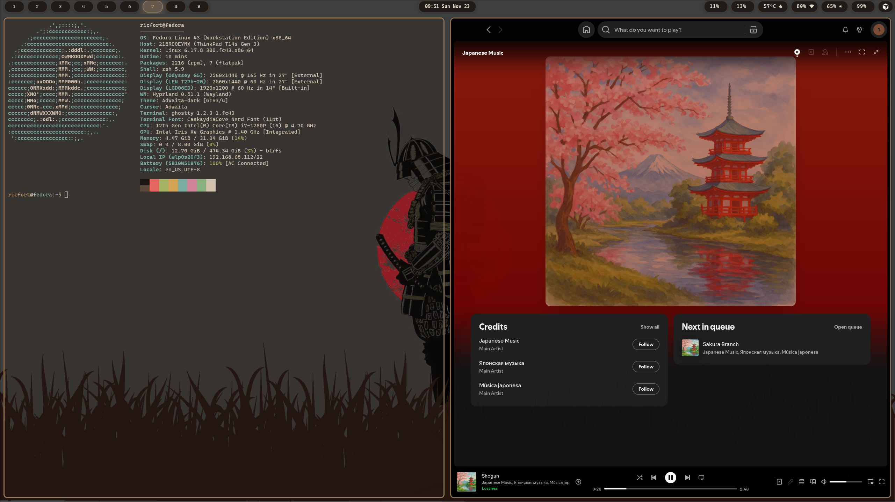
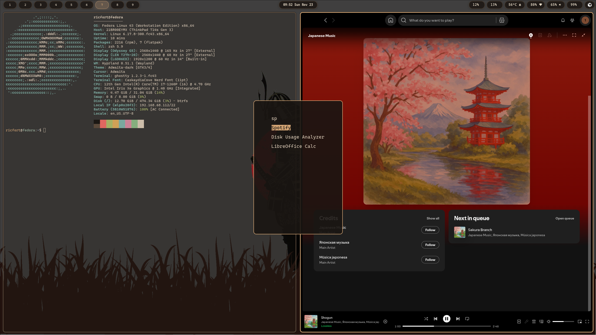
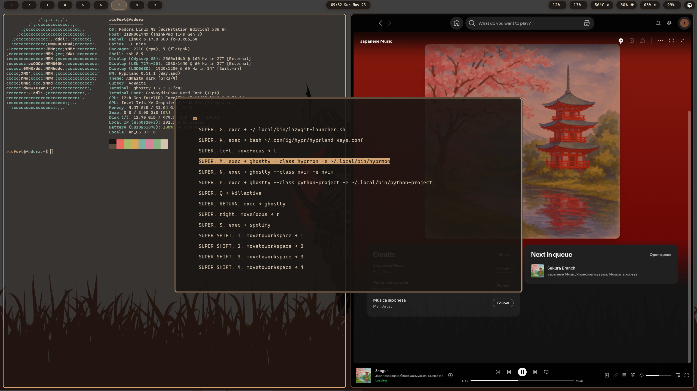
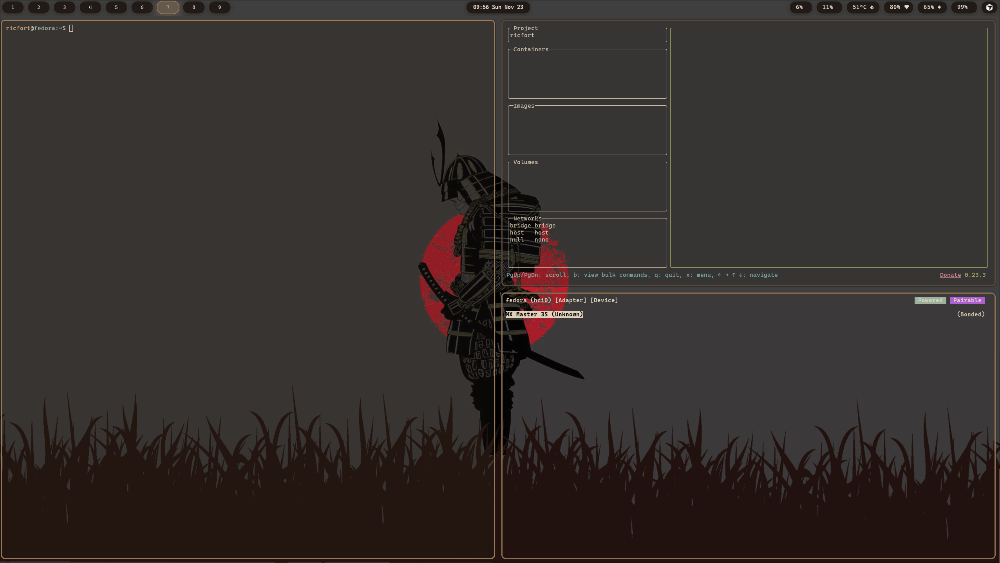

# Fedorarch

**Fedorarch** is a modular, Omarchy-style configuration framework for **Fedora Linux**. It provides a polished, keyboard-centric Wayland environment powered by **Hyprland**, with a focus on maintainability, modularity, and ease of use.

## 📸 Screenshots


*Main desktop with Hyprland, Waybar, and wallpaper*


*Tofi application launcher (Super+Space)*


*Ghostty terminal with development environment*


*Multi-monitor workspace setup*

## 🚀 Features

*   **Window Manager:** Hyprland (Wayland) with a "dwindle" layout.
*   **Terminal:** Ghostty - fast, GPU-accelerated.
*   **Launcher:** Tofi - minimal and fast.
*   **Bar:** Waybar - highly customizable status bar.
*   **Notifications:** Dunst.
*   **Shell:** Zsh with pure prompt.
*   **Development:** Neovim, Lazygit, Lazydocker, Mise, UV.
*   **Modular:** Logic (`scripts/lib`) is separated from configuration (`scripts/config`).
*   **Safe:** Supports `DRY_RUN` mode and includes validation scripts.

## 📦 Installation

### Prerequisites
*   A fresh install of Fedora Workstation (recommended) or Server.
*   Internet connection.

### One-Line Bootstrap
```bash
curl -fsSL https://raw.githubusercontent.com/ricfort/fedorarch/main/bootstrap.sh | bash
```

### Manual Installation
1.  Clone the repository:
    ```bash
    git clone https://github.com/ricfort/fedorarch.git ~/fedorarch
    cd ~/fedorarch
    ```
2.  Run the bootstrap script:
    ```bash
    ./bootstrap.sh
    ```

## 🛠 Configuration

The project is designed to be modular. You don't need to edit complex scripts to change what gets installed.

### Managing Packages
Edit `scripts/config/packages.sh` to add or remove standard Fedora packages.
To add a package interactively:
```bash
./scripts/add-package.sh
```

### Managing Repositories
Edit `scripts/config/repos.sh` to manage COPR repositories.

### Personal Settings
*   **Monitors:** Run `./scripts/configure-monitors.sh` or edit `~/.config/hypr/monitors.conf`.
*   **User Overrides:** Edit `~/.config/hypr/user.conf` for custom keybinds or rules. This file is sourced last and takes precedence.

### Web Apps & Profiles
This config is optimized for a multi-profile Chromium workflow:

*   **Personal Profile:** Launch with `Super + B`.
*   **Work Profile:** Launch with `Super + Shift + B`.

**Creating Web Apps:**
You can easily turn any website into a standalone desktop app (SSB) that integrates with your launcher and Hyprland rules.
```bash
make-webapp
```
This interactive tool will ask for:
1.  **Name:** (e.g., "Gmail")
2.  **URL:** (e.g., "mail.google.com")
3.  **Icon:** (Optional URL to an icon image)
4.  **Profile:** Choose whether it runs in your Personal or Work session.

Web apps are isolated, have no window decorations (handled by Hyprland), and appear in the `Super + Space` launcher.

### Deploying Changes
If you manually edit dotfiles in the `stow/` directory, run:
```bash
./scripts/deploy-configs.sh
```
Or simply:
```bash
./update.sh
```

## 📂 Project Structure

```text
fedorarch/
├── bootstrap.sh          # Entry point
├── scripts/
│   ├── config/           # Configuration files (packages, repos)
│   ├── lib/              # Shared logic (installers, helpers)
│   ├── install-packages.sh
│   ├── setup-repos.sh
│   └── ...
├── stow/                 # Dotfiles (managed by GNU Stow)
│   ├── hyprland/
│   ├── waybar/
│   └── ...
└── tests/                # Validation and unit tests
```

## 🛡 Testing & Validation

Before applying changes, you can validate the configuration:
```bash
./validate-configs.sh
```

To test the installation logic without changing your system:
```bash
DRY_RUN=1 ./scripts/install-packages.sh
```

## ⌨ Key Bindings (Cheat Sheet)

| Key | Action |
| :--- | :--- |
| `Super + Space` | App Launcher (Tofi) |
| `Super + Return` | Terminal (Ghostty) |
| `Super + Q` | Close Window |
| `Super + F` | Fullscreen |
| `Super + G` | Lazygit |
| `Super + D` | Lazydocker |
| `Super + K` | Show Keybinds |
| `Super + Shift + S` | Screenshot (Area) |


## Disclaimer on Chromium
I tried to profile and theme Chromium in a programmatic way, however looks like it tends to conflict and to not start properly.
I do not have time to fork it like the folks behind Omarchy did, so I would advice creating profile and theme from the UI, then binding it to the keys.


## 🤝 Contributing

1.  Fork the repository.
2.  Create a feature branch.
3.  Run `./validate-configs.sh` before committing.
4.  Submit a Pull Request.

---
*Built with ❤️ for Fedora Users.*
